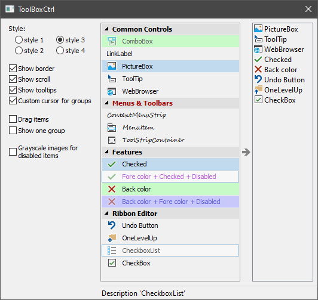

# ToolBoxCtrl



## Introduction

The control is similar to a regular ToolBar. It represents a tree. The command buttons are located in the branches of the tree and you have the ability to check and disable them.

Various uses of the control are possible. For example, as a sidebar for selecting the contents of the main program window or the current page in the settings window. Also, the control is convenient when used in different editors to select a working tool or component that can be dragged with the mouse into the editor field.

The control is derived from `CWnd` and is a common control based on MFC. It is possible to put it on any window: main frame, dialog, etc.

## Using the Code

To create the control and add elements to it, do the following:

```cpp
#include "ToolBoxCtrl.h"

ToolBoxCtrlEx<ToolBoxCtrlStyle_base_system> m_ToolBox;

...

if( !m_ToolBox.Create(this, WS_VISIBLE, CRect(10,10,100,200), ID_ToolBoxCtrl) )
  return -1;    // error.

// Load images for groups.
m_ToolBox.CreateImages(ToolBoxCtrl::ImageGroup,NULL,ID_PNG_GROUP_IMAGES,true,11);
// Load images for items.
m_ToolBox.CreateImages(ToolBoxCtrl::ImageItem,NULL,ID_PNG_ITEM_IMAGES,true,16);

// Add groups and items.
m_ToolBox.AddGroup(_T("Group 1"));
  m_ToolBox.AddItem(0, 1, _T("Item 1.1"),_T("Description for 'Item 1.1'"),0);
  m_ToolBox.AddItem(0, 2, _T("Item 1.2"),_T("Description for 'Item 1.2'"),1);
m_ToolBox.AddGroup(_T("Group 2");
  m_ToolBox.AddItem(1, 3, _T("Item 2.1"),_T("Description for 'Item 2.1'"),-1);
  m_ToolBox.AddItem(1, 4, _T("Item 2.2"),_T("Description for 'Item 2.2'"),2);
  m_ToolBox.AddItem(1, 5, _T("Item 2.3"),_T("Description for 'Item 2.3'"),3);

// Load state from registry.  
if( !m_ToolBox.LoadState(AfxGetApp(),_T("ToolBoxCtrl"),_T("State")) )
  m_ToolBox.CollapseGroup(1);   // some default state.

m_ToolBox.Update(true);
````

Class `ToolBoxCtrl` does not perform any rendering. For its drawing, it calls the functions of `ToolBoxCtrl::Draw` interface. To draw `ToolBoxCtrl`, you need to create an object inherited from the `ToolBoxCtrl::Draw` class, implement its functions, and pass the `ToolBoxCtrl::Draw` pointer to `ToolBoxCtrl` using the `ToolBoxCtrl::SetDrawManager` function call. Similarly, a `ToolBoxCtrl::IRecalc` interface is used to specify the spacing between `ToolBoxCtrl` areas. A `ToolBoxCtrl::ToolTip` interface will help you create tooltips for items. There is also a `ToolBoxCtrl::Notify` class for notifying about events in `ToolBoxCtrl`. An implementation of any of these four interfaces must exist for the entire time the control is running.

The `ToolBoxCtrl::Draw` and `ToolBoxCtrl::IRecalc` interfaces together define how a control will look, and their implementation can be called a style. The *ToolBoxCtrl.cpp/ToolBoxCtrl.h* files include four predefined style classes: `ToolBoxCtrlStyle_base_system`, `ToolBoxCtrlStyle_classic_system`, `ToolBoxCtrlStyle_base_orange`, and `ToolBoxCtrlStyle_classic_orange`. The first two classes use the system colors to draw the `ToolBoxCtrl`. If you are working with only one style, then use the template class `ToolBoxCtrlEx`. The name of the style class is specified as a template parameter, for example:

```cpp
ToolBoxCtrlEx<ToolBoxCtrlStyle_base_system> m_ToolBox;
````

The user can work with `ToolBoxCtrl` in one of two ways.

* When you pass the `ActivateModeClick` value to the `ToolBoxCtrl::SetActivateMode` function, tree items behave like regular buttons. When you click on them, the `Notify::OnClickItem` function is called.

* When using the `ActivateModeDrag` value, the tree items must be dragged with the mouse, for example, into the editor area located next to it. At the start of the drag, the `Notify::OnDragItemStart` function is called. See the `OnDragItemStart`, `OnMouseMove`, `OnLButtonUp`, `OnCaptureChanged` functions located in the *Dialog.cpp* file to learn more about the possible implementation of this mechanism in your program.

Tree elements can be checked and/or disabled. You can do this at any time by calling `ToolBoxCtrl::CheckItem` and `ToolBoxCtrl::EnableItem`. Also, the control itself is able to send a request to update the state of the items in it. To do this, it calls the `Notify::OnUpdateItemState` function at short intervals. This mode is enabled by calling `ToolBoxCtrl::EnableDynamicItemsUpdate(true)`. The `Notify::OnUpdateItemState` function can be called separately for each visible item in the tree, or once for all items. This is determined by the value passed to the `ToolBoxCtrl::SetUpdateMode` function.

The control requires a call to `ToolBoxCtrl::Update()` after changing its state, properties, or the number of groups and elements in it.

Good luck! :-)
